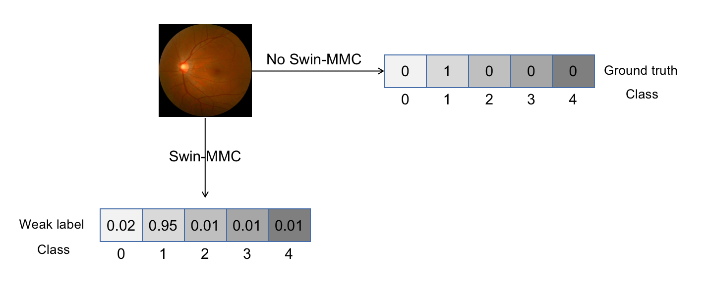

# Our team in MICCAI MMAC 2023 - Myopic Maculopathy Analysis Challenge - Task 1 
This repository contains our team's training lists and scripts used in [MICCAI MMAC 2023](https://codalab.lisn.upsaclay.fr/competitions/12441). An effective computer-aided system is essential to help ophthalmologists analyze myopic maculopathy, further providing accurate diagnosis and reasonable intervention for this disease. Given a training dataset, the task of the challenge was to classify the five categories of myopic macular degeneration. We trained several deep learning models based on the [Swin-base](https://github.com/microsoft/Swin-Transformer). Our best submission achieved a Mean score (Quadratic-weighted Kappa (QWK), F1 score, Specificity) score of 0.8660 (Rank 2) in the Test Phase and 0.8823 (Rank 1) in the Futher Test Phase. The official results can be found [here](https://codalab.lisn.upsaclay.fr/competitions/12441#results).

## Methodology

Our all models are based on the [Swin-Transformer](https://github.com/microsoft/Swin-Transformer), which is a vision transformer model. We used the Swin-Base model with the input size of 384x384. We add [ArcFace Loss](https://arxiv.org/abs/1801.07698) to the model to improve the classification performance, and we use a weak label strategy to train the model.





## Getting Started

### Step 1 : Configure the mmpretrain environment

```bash
git clone https://github.com/qingtian5/miccai23_mmac_task1.git
cd miccai23_mmac_task1
conda create -n miccai_mmpre python=3.8 pytorch==1.11.0 torchvision==0.12.0 cudatoolkit=11.3 -c pytorch -y
conda activate miccai_mmpre
pip3 install openmim
git clone https://github.com/open-mmlab/mmpretrain.git
cd mmpretrain
pip3 install openmim && mim install -e .
cd ..
```

### Step 2 : Place the images in the data directory

1. The dataset can be download by the [Google Drive](https://drive.google.com/drive/folders/1Mcq8c8z33APGPGXPc83QZTMf6xDdIH2C). And the directory under data should be as follows.

```bash
data
├── classification_train_val # This means the training set and the validation set are put together 
├── classification_train
└── classification_val
```

2. For each folder, the ground truth label file (meta/train.txt) needs to be generated in the following way. If it is a validation set, change the path to meta/val.txt.

```python
import pandas as pd

data = pd.read_csv("MICCAI_TASK1/data/classification_train/Groundtruths/train_labels.csv")

with open("MICCAI_TASK1/data/classification_train/meta/train.txt","w") as f:
    for idx, d in data.iterrows():
        f.write(d["image"] + " " + str(d["myopic_maculopathy_grade"]) + "\n")
```

3. The following format is required for each folder under data. If is the validation dataset, the label file should be meta/val.txt. 

```bash
classification_train
├── Groundtruths
│   └── train_labels.csv
├── Images
│   └── train
│       ├── mmac_task_1_train_0001.png
│       ├── mmac_task_1_train_0002.png
│       ├── ...
│       └── mmac_task_1_train_1143.png
├── LICENSE.txt
└── meta
    └── train.txt
```

```bash
classification_val
├── Groundtruths
│   └── val_labels.csv
├── Images
│   └── val
│       ├── mmac_task_1_val_0001.png
│       ├── mmac_task_1_val_0002.png
│       ├── ...
│       └── mmac_task_1_val_0248.png
├── LICENSE.txt
└── meta
    └── val.txt
```

### Step 3 : Place pre-trained weights in the pretrained_ckpt catalog.

Run the following command on the terminal

```bash
cd pretrained_ckpt
wget https://download.openmmlab.com/mmclassification/v0/swin-transformer/convert/swin_base_patch4_window7_224_22kto1k-f967f799.pth
cd ..
```

### Step 4 : Run the training script

Run the following command on the terminal

```bash
cd mmpretrain
python tools/train.py ../projects/submission/my_swin_base_in1k_384.py
```

### Step 5 : submit the results

Run the following command on the terminal

```bash
cd ../projects/submission
mv ../working/epoch_36.pth ./epoch_36.pth
zip -r submission.zip .
```

Then submit the submission.zip file to the competition website [Link](https://codalab.lisn.upsaclay.fr/competitions/12441#participate).


## Citation

If you find our work helpful, please consider citing the following papers

```
@inproceedings{lu2023swin,
  title={Swin-MMC: Swin-Based Model for Myopic Maculopathy Classification in Fundus Images},
  author={Lu, Li and Pan, Xuhao and Jin, Panji and Ding, Ye},
  booktitle={International Conference on Medical Image Computing and Computer-Assisted Intervention},
  pages={18--30},
  year={2023},
  organization={Springer}
}
```
